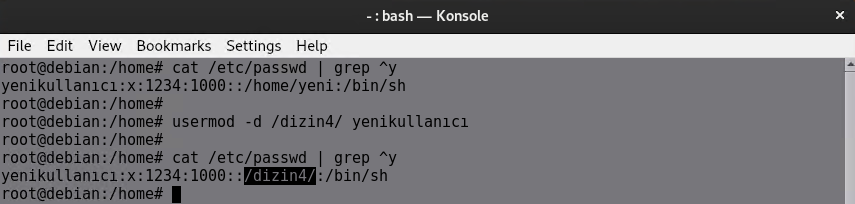

# **Linux Kullanıcı ve Grupları**

## Kullanıcı ve Grup Kavramı

**Kullanıcı :** Bir Linux sisteminde kullanıcılar, oturum açarak ve çeşitli görevleri yerine getirerek işletim sistemiyle etkileşime giren bireyleri veya varlıkları ifade eder. [[1]](#kaynakça)

**Sistem kullanıcıları** sistem kurulumu sırasında sistem tarafından oluşturulur ve sistem servislerini ve uygulamalarını çalıştırmak için kullanılır. [[1]](#kaynakça)

**Normal kullanıcılar** yönetici tarafından oluşturulur ve izinleri doğrultusunda sisteme ve kaynaklara erişebilirler. [[1]](#kaynakça)

**Gruplar :** birden fazla kullanıcı için aynı anda izinler ayarlamanıza olanak tanır ve bu sayede hangi dosyalara ve dizinlere kimin erişebileceğini yönetmeniz kolaylaşır. Linux'un cephaneliğindeki basit ama güçlü bir araçtır ve her şeyi hem erişilebilir hem de güvenli tutmaya yardımcı olur.[[2]](#kaynakça)

Gruplar, **Primary (Birincil)** ve **Secondary (İkincil)** olmak üzere ikiye ayrılırlar.
Her kullanıcı, kendi adıyla aynı olan bir grubun üyesidir ve bu grup, Primary olandır.
Secondary gruplar isteğe bağlıdır.

Kullanıcının adı, user ID (UID)’si, üye olduğu gruplar ve grup ID (GID)’leri, id komutuyla görüntülenebilir.
Farklı bir kullanıcı için id <username> şeklinde kullanılabilir.

Her kullanıcı oturum kullanmayabilir. Bu sebeple bir shell veya /home dizini tanımları bulunmayabilir

Sistemdeki kullanıcılar compgen -u ve gruplar ise compgen -g komutlarıyla da listelenebilir.

| İlgili Dosyalar     | İçerik Açıklaması                                     
|-------------------|-------------------------------------------------------|
| `/etc/passwd`     | Sistemdeki tüm kullanıcı hesapları ve bilgileri yer alır. Bu dosya, her bir kullanıcı için kullanıcı adı, UID, grup ID'si (GID), ev dizini ve kabuk gibi bilgileri içerir. | 
| `/etc/group`      | Sistemdeki tüm gruplar ve gruplara ait bilgiler yer alır. Her grup için grup adı, grup ID'si (GID) ve grup üyeleri listelenir. | 
| `/etc/shadow`     | Kullanıcıların şifre bilgileri ve parola özellikleri (şifrenin son değiştirilme tarihi, şifre geçerlilik süresi vb.) yer alır. Bu dosya, şifrelerin güvenli bir şekilde saklanması için şifrelenmiş formatta tutulur. | 

## **Passwd Dosya Formatı**

1. **username**: Kullanıcıyı sistemde tanımlayan isim.
2. **password**: Şifreyi temsil eder. Ancak, modern Linux sistemlerinde şifreler genellikle `/etc/shadow` dosyasında saklanır. Burada yer alan `x` veya `*` gibi semboller, gerçek şifrenin o dosyada saklandığını gösterir.
3. **UID**: Kullanıcının benzersiz kimlik numarası. Bu numara, sisteme giriş yapan her kullanıcıyı tanımlamak için kullanılır. 
4. **GID**: Kullanıcının birincil grup kimliği. Her kullanıcı, bir veya birden fazla grupta yer alabilir. Bu alan, kullanıcının birincil grubunun GID'sini belirtir. 
5. **GECOS**: Bu alan genellikle kullanıcı hakkında daha fazla bilgi içerir (ad, soyad, telefon numarası vb.). Ancak genellikle boş bırakılabilir.
6. **home_directory**: Kullanıcının ana dizini. Kullanıcı giriş yaptığında bu dizin, kullanıcının çalışma alanı olarak atanır.
7. **shell**: Kullanıcının varsayılan kabuğu. Bu, kullanıcının terminal oturumu açtığında çalıştırılacak kabuk programını belirtir. Yaygın değerler şunlar olabilir: `/bin/bash`, `/bin/zsh`, `/bin/sh`.

## **Shadow Dosya Formatı**

1. **username**: Kullanıcı adı.
2. **password**: Kullanıcının şifresi. Şifre, hashlenmiş bir değere dönüştürülür. Eğer şifre boş bırakılmışsa, bu kullanıcı şifresiz olarak tanımlanmış demektir. Şifreyi içermeyen `*` veya `!` gibi özel karakterler de kullanılabilir.
3. **lastchg**: Şifrenin son değiştirilme zamanı (gün cinsinden, 1970-01-01'den itibaren).
4. **min**: Şifre değişikliği için minimum gün sayısı. Bu, şifrenin değiştirilmesinin en erken ne zaman yapılabileceğini belirler.
5. **max**: Şifrenin geçerlilik süresi (gün cinsinden). Bu süre dolduğunda kullanıcı şifresini değiştirmek zorundadır.
6. **warn**: Şifrenin geçerliliği sona ermeden önce kullanıcıya uyarı verilmesi gereken gün sayısı.
7. **inactive**: Şifre geçerliliği sona erdikten sonra, kullanıcı hesabının devre dışı kalmadan önceki süre (gün cinsinden).
8. **expire**: Kullanıcı hesabının sona erdiği tarih. Hesap, bu tarihten sonra geçersiz olur.
9. **reserved**: Bu alan, boş bırakılır ve gelecekteki kullanımlar için ayrılmıştır.

## **Kullanıcı-Grup Yönetim Komutları**

### **Oluşturma Komutları**

| **Komut**                               | **İşlev**                                                                                             |
|-----------------------------------------|------------------------------------------------------------------------------------------------------|
| `useradd <kullanıcıadı>`                | Kullanıcı oluşturur.                                                                                 |
| `useradd -u <UID> <kullanıcıadı>`       | `-u` parametresiyle UID tanımlı şekilde kullanıcı oluşturulabilir. Primary GUI, UID’le aynı olur.    |
| `useradd -g <GID/grupadı> <kullanıcıadı>` | `-g` parametresiyle bir grubun üyesi olarak kullanıcı oluşturulabilir. `-G` ile birden fazla grup belirtilebilir. |
| `useradd -m <kullanıcıadı>`             | `-m` parametresiyle home dizini de oluşturulabilir.                                                   |
| `useradd -m -d <path> <kullanıcıadı>`   | `-d` parametresi ile spesifik bir home dizini belirtilebilir. `-m` home dizini oluşturur.            |
| `useradd -s <shell path> <kullanıcıadı>` | `-s` parametresi ile shell tanımlı şekilde kullanıcı oluşturulabilir.                                |
| `useradd -c <yorum> <kullanıcıadı>`     | `-c` parametresi ile GECOS tanımlı şekilde kullanıcı oluşturulabilir.                                |
| `useradd -e <tarih> <kullanıcıadı>`     | `-e` parametresi ile hesap sona erme tarihiyle kullanıcı oluşturulabilir.                            |
| `groupadd <grupadı>`                    | Belirtilen isimde bir grup oluşturur.  |

### **useradd <kullanıcıadı>**
Kullanıcı oluşturur.

---

### **useradd -u <UID> <kullanıcıadı>**
`-u` parametresiyle UID tanımlı şekilde kullanıcı oluşturulabilir. Primary GID, UID ile aynı olur.

---

### **useradd -g <GID/grupadı> <kullanıcıadı>**
`-g` parametresiyle bir grubun üyesi olarak kullanıcı oluşturulabilir. `-G` ile birden fazla grup belirtilebilir.

---

### **useradd -m <kullanıcıadı>**
`-m` parametresiyle home dizini de oluşturulabilir.

---

### **useradd -m -d <path> <kullanıcıadı>**
`-d` parametresi ile spesifik bir home dizini belirtilebilir. `-m` home dizini oluşturur.

---

### **useradd -s <shell path> <kullanıcıadı>**
`-s` parametresi ile shell tanımlı şekilde kullanıcı oluşturulabilir.

---

### **useradd -c <yorum> <kullanıcıadı>**
`-c` parametresi ile GECOS tanımlı şekilde kullanıcı oluşturulabilir.

---

### **useradd -e <tarih> <kullanıcıadı>**
`-e` parametresi ile hesap sona erme tarihiyle kullanıcı oluşturulabilir.

---

### **groupadd <grupadı>**
Belirtilen isimde bir grup oluşturur.

---
---

### **Değiştirme Komutları**

| **Komut**                                      | **Açıklama**                                                                                          |
|----------------------------------------------|------------------------------------------------------------------------------------------------------|
| `usermod -l <yeni_ad> <eski_ad>`            | Kullanıcının adını değiştirir.                                                                      |
| `usermod -u <UID> <kullanıcıadı>`           | Kullanıcıya yeni bir kullanıcı kimliği (UID) atar.                                                  |
| `usermod -g <GID/grupadı> <kullanıcıadı>`   | Kullanıcının birincil grubunu değiştirir.                                                           |
| `usermod -G <grup1,grup2> <kullanıcıadı>`   | Kullanıcıyı belirtilen ek gruplara dahil eder.                                                       |
| `usermod -aG <grupadı> <kullanıcıadı>`      | Kullanıcıyı mevcut gruplarına dokunmadan belirli bir gruba ekler. (`-G` ile kullanılırsa eski grupları siler.) |
| `usermod -d <yeni_dizin> <kullanıcıadı>`    | Kullanıcının ana dizinini değiştirir (dizini manuel taşımanız gerekir).                             |
| `usermod -m -d <yeni_dizin> <kullanıcıadı>` | Kullanıcının ana dizinini değiştirir ve içeriği otomatik taşır.                                     |
| `usermod -s <shell_path> <kullanıcıadı>`    | Kullanıcının varsayılan kabuğunu değiştirir (`/bin/bash`, `/bin/zsh` vb.).                         |
| `usermod -c "<yorum>" <kullanıcıadı>`       | Kullanıcı hakkında açıklayıcı bir bilgi ekler veya değiştirir (GECOS alanı).                        |
| `usermod -e <YYYY-MM-DD> <kullanıcıadı>`    | Kullanıcının hesabı için sona erme tarihi belirler.                                                 |
| `usermod -L <kullanıcıadı>`                 | Kullanıcının hesabını kilitler.                  |
| `usermod -U <kullanıcıadı>`                 | Daha önce kilitlenmiş bir hesabı açar (unlock eder).                                                |
| `chage -l <kullanıcıadı>`                | Kullanıcının parola kullanım ve hesap özelliklerini görüntüler.                                       |
| `chage -M <günsayısı> <kullanıcıadı>`    | Kullanıcının parolasının maksimum yaşam süresini belirtir.                                           |
| `chage -E <tarih> <kullanıcıadı>`        | Kullanıcının hesap sona erme süresini belirler. `-E 0` ile hesap devre dışı bırakılabilir.           |
| `passwd -u <kullanıcıadı>`               | Kilitlenen hesabı açar (unlock eder). Durumu `-S` parametresiyle görüntülenebilir.                   |
| `passwd <kullanıcıadı>`                  | Kullanıcının parolasını değiştirir. Tek başına kullanıldığında geçerli kullanıcı için çalışır.        |
| `gpasswd <grupadı> -d <kullanıcıadı>`    | Belirtilen gruptan, belirtilen kullanıcıyı çıkartır.                                                 |

### **usermod -l <yeni_ad> <eski_ad>**
Kullanıcının adını değiştirir.

---

### **usermod -u <UID> <kullanıcıadı>**
Kullanıcıya yeni bir kullanıcı kimliği (UID) atar.

---

### **usermod -g <GID/grupadı> <kullanıcıadı>**
Kullanıcının birincil grubunu değiştirir.

---

### **usermod -G <grup1,grup2> <kullanıcıadı>**
Kullanıcıyı belirtilen ek gruplara dahil eder.

---

### **usermod -aG <grupadı> <kullanıcıadı>**
Kullanıcıyı mevcut gruplarına dokunmadan belirli bir gruba ekler.

---

### **usermod -d <yeni_dizin> <kullanıcıadı>**
Kullanıcının ana dizinini değiştirir.

---

### **usermod -m -d <yeni_dizin> <kullanıcıadı>**
Kullanıcının ana dizinini değiştirir ve içeriği otomatik taşır.

---

### **usermod -s <shell_path> <kullanıcıadı>**
Kullanıcının varsayılan kabuğunu değiştirir.

---

### **usermod -c "<yorum>" <kullanıcıadı>**
Kullanıcı hakkında açıklayıcı bir bilgi ekler veya değiştirir.

---

### **usermod -e <YYYY-MM-DD> <kullanıcıadı>**
Kullanıcının hesabı için sona erme tarihi belirler.

---

### **usermod -L <kullanıcıadı>**
Kullanıcının hesabını kilitler.

---

### **usermod -U <kullanıcıadı>**
Daha önce kilitlenmiş bir hesabı açar (unlock eder).

---

### **chage -l <kullanıcıadı>**
Kullanıcının parola kullanım ve hesap özelliklerini görüntüler.

---

### **chage -M <günsayısı> <kullanıcıadı>**
Kullanıcının parolasının maksimum yaşam süresini belirtir.

---

### **chage -E <tarih> <kullanıcıadı>**
Kullanıcının hesap sona erme süresini belirler.

---

### **passwd -u <kullanıcıadı>**
Kilitlenen hesabı açar (unlock eder).

---

### **passwd <kullanıcıadı>**
Kullanıcının parolasını değiştirir.

---

### **gpasswd <grupadı> -d <kullanıcıadı>**
Belirtilen gruptan, belirtilen kullanıcıyı çıkarır.

---
---

### **Kaldırma Komutaları**

| **Komut**                          | **Açıklama**                                                                 |
|------------------------------------|-----------------------------------------------------------------------------|
| `userdel <kullanıcıadı>`           | Kullanıcıyı siler.                                                          |
| `userdel -r <kullanıcıadı>`        | Kullanıcıyı ve varsa home dizinini birlikte siler.                          |
| `userdel -f <kullanıcıadı>`        | Kullanıcıyı, varsa çalışan işlemleri kapatmaya zorlayarak siler.            |
| `userdel -Z <kullanıcıadı>`        | Kullanıcıyı, varsa SELinux girdileriyle birlikte siler.                     |
| `groupdel <grupadı>`               | Belirtilen isimdeki grubu siler.                                            |

### **userdel <kullanıcıadı>**
Kullanıcıyı siler.

---

### **userdel -r <kullanıcıadı>**
Kullanıcıyı ve varsa home dizinini birlikte siler.

---

### **userdel -f <kullanıcıadı>**
Kullanıcıyı, varsa çalışan işlemleri kapatmaya zorlayarak siler.

---

### **groupdel <grupadı>**
Belirtilen isimdeki grubu siler.

---
---

## **Kaynakça**

[1 . Linux'ta Kullanıcı Yönetimi (freeCodeCamp)](https://www.freecodecamp.org/news/how-to-manage-users-in-linux)  

[2 . Linux'ta Grupları Listeleme (Server Academy)](https://serveracademy.com/blog/linux-list-groups/)  

[3 . /etc/passwd Dosya Formatı Açıklaması (CyberCiti)](https://www.cyberciti.biz/faq/understanding-etcpasswd-file-format/)  

[4 . /etc/shadow Dosya Formatı Açıklaması (CyberCiti)](https://www.cyberciti.biz/faq/understanding-etcshadow-file/)  
